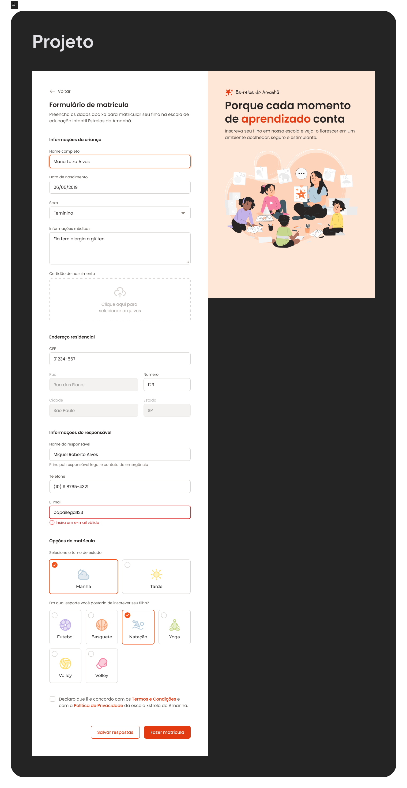

# Projeto formulário de matrícula

Utilizando apenas conceitos de HTML 5 e CSS 3.

Foco na estilização de formulários apenas com html e css.

```css
inputs, wrappers, select, radio, checkbox, file, date, email
```

Demo: <https://tiagomartinscc.github.io/projeto-formulario-matricula/>



<small>Este projeto faz parte do MBA Fullstack da Rocketseat - 2024</small>

